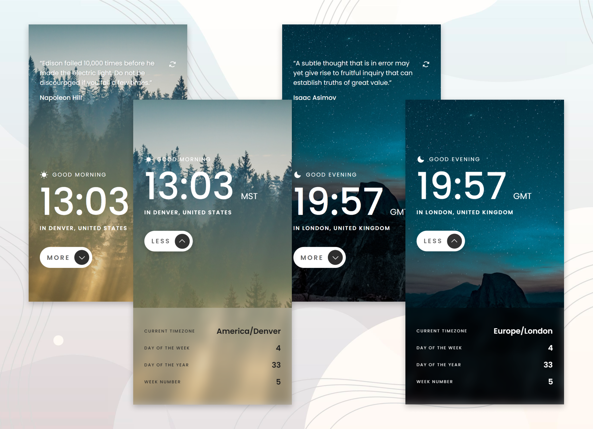

# Frontend Mentor - Clock app

### The challenge

Users should be able to:

- View the optimal layout for the site depending on their device's screen size
- See hover states for all interactive elements on the page
- View the current time and location information based on their IP address
- View additional information about the date and time in the expanded state
- Be shown the correct greeting and background image based on the time of day they're visiting the site
- Generate random quotes by clicking the refresh icon near the quote

### Built with

- React (Hooks, Context API)
- Axios
- Styled components

### Screenshot

### Links

- Solution URL: [GitHub](https://github.com/DorottyaB/clock-app)
- Live Site URL: [on Vercel](https://pomodoro-app-self-nine.vercel.app/)

## Author

- Website - [Dorottya](https://github.com/DorottyaB)
